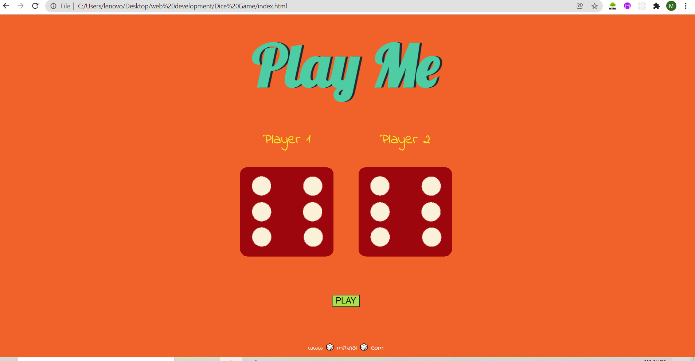
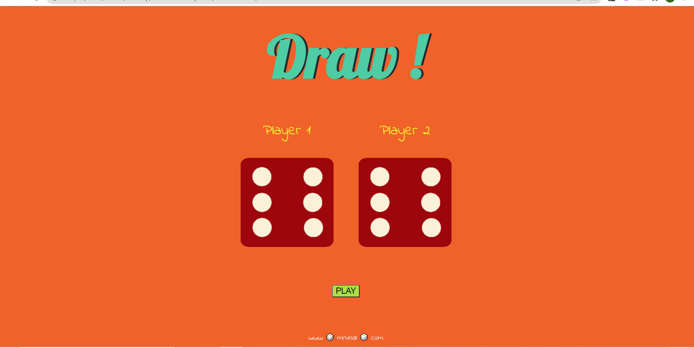
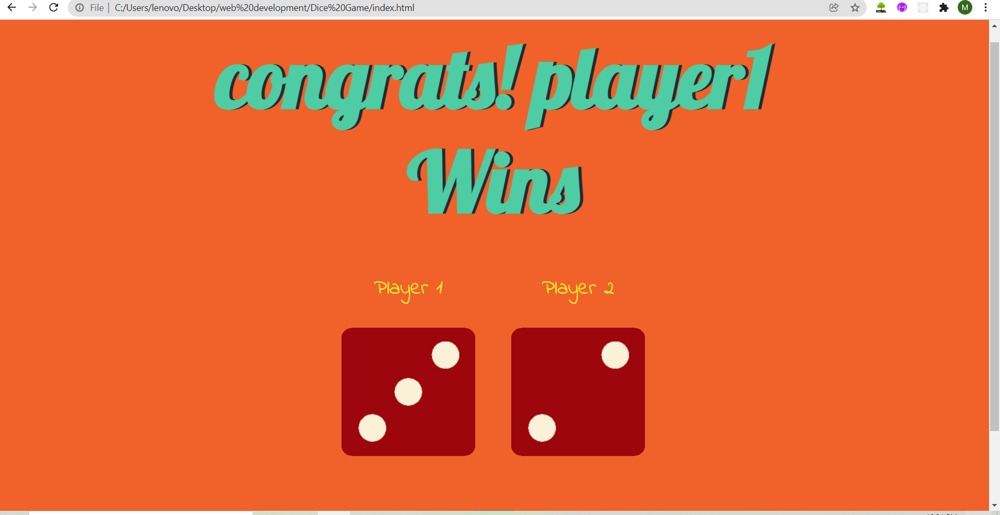
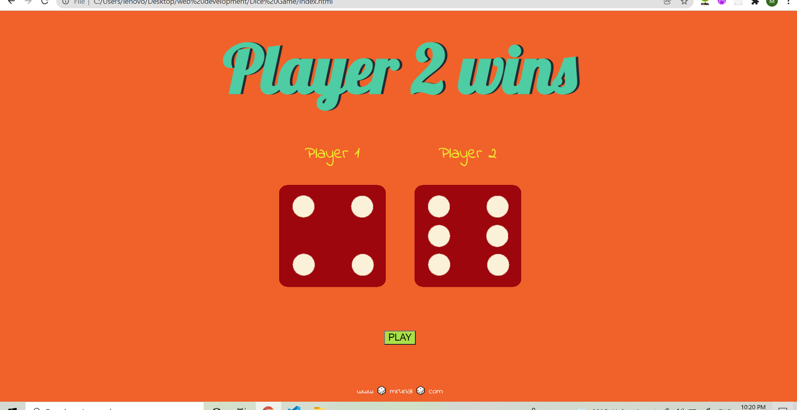

# Dice-Game

***play here https://mrunal-13.github.io/Dice-Game/***

 

## Table of content

1>[Introduction](#Introduction)

2>[How to Play?](#How-to-Play?)

3>[Images](#Images)

4>[Resources](#Resources)

## Introduction

Dice game is web application designed using js,html and css. It is as simillar as tossing coin and deciding which player to play match.If you are confused in deciding who wins the toss between two then simply press the play button on dice game and two dices are rolled and one with bigger dice number wins the game.Try using it to decide your game.

## How to Play?
1)open the link given in the title.

2)Decide your team player 1 or player 2 then click play.The dice is rolled and winner  is declared.

## Images

Here the game is started and you are requested to click play button below.

Both dice got same number on rolling hence DRAW!

player 1 dice has greater number then player 2 therefore player 1 is winner.

player 1 dice has lesser number than player 2 so player 2 wins.

## Resources

Languages used:-
HTML,CSS,JS

Environment used :- VS Code

web app hosted on github pages and also deployed on heroku.

Thank you.....See you in next project.
